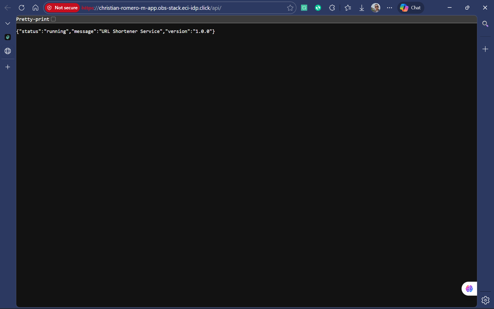
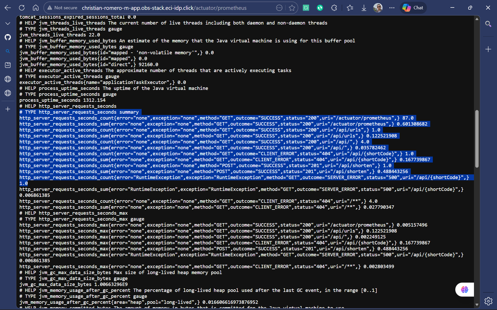
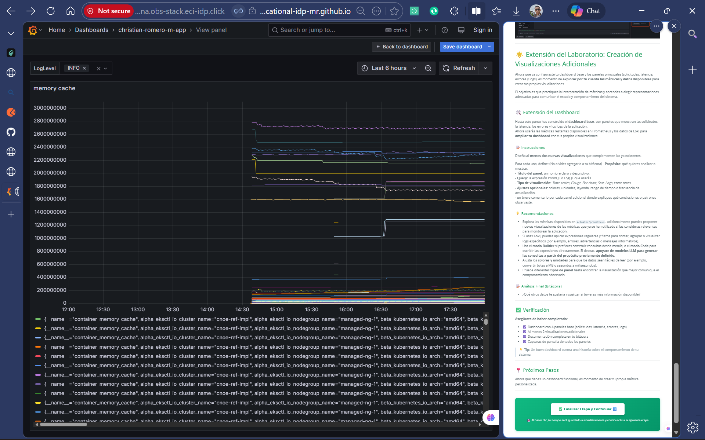
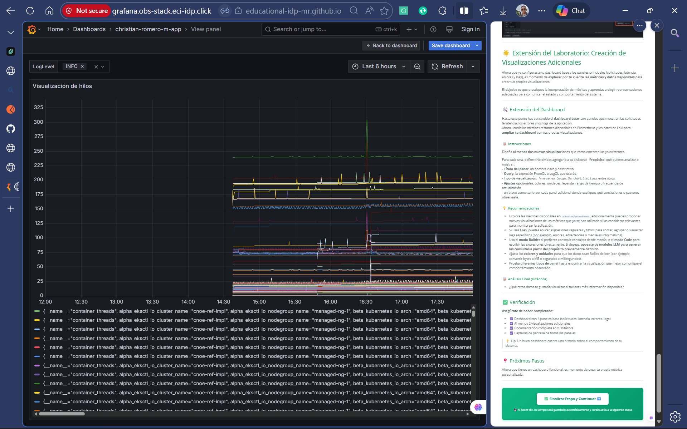

# Bitácora Experimento - Observabilidad y Monitoreo

**Nombre del estudiante:** _____________________________  
---
Cuando acabes no olvides ayudarnos evaluando tu ⭐[experiencia](https://forms.office.com/r/JCyhCpujrt)⭐
---

## Tabla de Contenidos
- [Etapa 1: Preparación del Ambiente](#etapa-1-preparación-del-ambiente)
- [Etapa 2: Métricas Iniciales](#etapa-2-métricas-iniciales)
- [Etapa 2.1: Dashboard Base en Grafana](#etapa-21-dashboard-base-en-grafana)
- [Etapa 2.2: Propuesta de Métrica Personalizada](#etapa-22-propuesta-de-métrica-personalizada)
- [Etapa 3: Experimentación y Análisis del Sistema](#etapa-3-experimentación-y-análisis-del-sistema)

---

## Etapa 1: Preparación del Ambiente

### 1.1. Información de la aplicación

### 1.2. Verificación del despliegue

**¿La aplicación se desplegó correctamente?** 

- [X] Sí
- [ ] No

**Captura de pantalla de la aplicación funcionando:**

> 

### 1.3. Observaciones y problemas encontrados (opcional)

```


```

---

## Etapa 2: Métricas Iniciales

### 2.0.1. Generación de tráfico

**Endpoints probados:**

- [X] `GET /api/`
- [X] `POST /api/shorten`
- [X] `GET /api/{shortCode}`
- [X] `GET /api/urls`


### 2.0.2. Análisis de dos métricas relevantes

#### Métrica 1



**Nombre de la métrica:**  
```
http_server_requests_seconds_count
```

**Tipo de métrica:** 
- [X] Counter
- [ ] Gauge 
- [ ] Histogram 
- [ ] Summary

**Descripción de qué información aporta:**
```
Cuenta el número total de solicitudes HTTP procesadas por el servidor.
Permite observar el volumen de tráfico que recibe la aplicación.
```

**Relación con otras métricas (si aplica):**
```

```

**¿En que escenarios puede ayudar esta métrica?**
```
Detectar picos de tráfico.
Evaluar la carga del sistema.
Ver los endpoints más utilizados.
```

**¿Qué etiquetas (labels) se utilizan para agrupar los datos?**
```
method, uri, status, instance, job
```

---

#### Métrica 2

**Nombre de la métrica:**  
```
http_server_requests_seconds_bucket
```

**Tipo de métrica:** 
- [ ] Counter
- [ ] Gauge 
- [X] Histogram 
- [ ] Summary

**Descripción de qué información aporta:**
```
Distribuye la duración de las solicitudes HTTP en intervalos de tiempo.
Permite ver la latencia de los endpoints.
```

**Relación con otras métricas (si aplica):**
```
Se relaciona con http_server_requests_seconds_count (cantidad de solicitudes) 
y http_server_requests_seconds_sum (tiempo total acumulado).
Puede correlacionarse con errores (status=500) para ver si las fallas coinciden con tiempos altos.
```

**¿En que escenarios puede ayudar esta métrica?**
```
Identificar problemas de rendimiento en endpoints específicos.
Detectar latencias anómalas en horarios de alta carga.
Evaluar la experiencia del usuario en términos de tiempo de respuesta.
```

**¿Qué etiquetas (labels) se utilizan para agrupar los datos?**
```
method, uri, status, instance, job
```

---

## Etapa 2.1: Dashboard Base en Grafana


### 2.1.1. Evidencia: Dashboard Base en Grafana con los 4 paneles iniciales

**Captura de pantalla del dashboard:**

> _[Inserta aquí la imagen del dashboard con los 4 paneles]_

### 2.1.2. Visualizaciónes Adicionales (Con las metricas actuales)

#### Visualización Adicional 1

**Propósito:**
```
Monitoreo del cache en memoria
```

**Título del panel:**
```
Memory cache
```

**Consulta (PromQL o LogQL):**
```
container_memory_cache

```

**Tipo de visualización:** 
- [X] Time series
- [ ] Gauge
- [ ] Bar chart
- [ ] Stat
- [ ] Logs
- [ ] Otro: _____

**Otros ajustes aplicados (colores, unidades, etc.) (opcional):**
```
Deje las variables por defecto
```

**Captura de pantalla:**

> 

**Análisis (2-3 frases):**
```
Observo un comportamiento estable donde cuando hago peticiones sube y vuelve a normalizarse
```

---

#### Visualización Adicional 2

**Propósito:**
```

```

**Título del panel:**
```
Visualizacion de hilos
```

**Consulta (PromQL o LogQL):**
```
container_threads
```

**Tipo de visualización:** 
- [X] Time series
- [ ] Gauge
- [ ] Bar chart
- [ ] Stat
- [ ] Logs
- [ ] Otro: _____

**Otros ajustes aplicados (colores, unidades, etc.) (opcional):**
```

```

**Captura de pantalla:**

> 

**Análisis (2-3 frases):**
```
Puedo analizar el procesamiento, picos y en que actividades hay demanda, asi mismo tomas desiciones de escalado

```

---

### 2.1.3. Análisis final del dashboard

**¿Qué otros datos te gustaría visualizar si tuvieras más información disponible?**
```
La metrica que me gustaria ver es el trafico y cantidad de soluciones de url
```

---

## Etapa 2.2: Propuesta de Métrica Personalizada


### Análisis y propuesta de la métrica propia (en Java)

**1. Nombre de la métrica:**
```
url_shortener_urls_created_total
```

**2. Tipo de métrica:**
- [X] Counter
- [ ] Gauge

**3. ¿Qué comportamiento mide?**
```
Cuenta el número total de URLs que han sido acortadas exitosamente.
```

**4. ¿Por qué es relevante para el sistema?**
```
Permite monitorear el uso del servicio y analizar tendencias de uso a lo largo del tiempo. Es útil para identificar picos de actividad y evaluar la carga del sistema.
```

---

### Visualización en Grafana

**1. ¿Qué tipo de panel usaste en Grafana?**

- [ ] Time series  
- [ ] Gauge  
- [ ] Stat  
- [ ] Bar chart  
- [ ] Otro: _____

**2. ¿Qué consulta PromQL vas a utilizar?**
```promql


```

**3. ¿Cuál es el propósito de la visualización?**
```
Provee una interpretación en palabras con el propósito de la visualización. Que te interesa ver en el panel?


```

---

### Panel creado en Grafana

**Captura de pantalla del panel en Grafana:**

> _[Inserta aquí la imagen del panel mostrando la métrica visualizada]_

---

## Etapa 3: Experimentación y Análisis del Sistema

### 3.1. Detección de anomalías y puntos de interés

**1. Como describirias la anomalía?**

```


```

**2. Que paneles te ayudaron a identificarlo?**

``` 


```

**3. Cual podria ser la causa de la anomalía?**

``` 


```

**Captura de pantalla del dashboard mostrando la anomalía:**

> _[Inserta aquí la imagen]_

---

### 3.2. Intento de corrección de anomalías


#### 3.2.1. Modificación del código

**Descripción del ajuste realizado:**
```
Describe en pocas palabras el ajuste realizado.


```

#### 3.2.2. Resultados después del despliegue

**¿El ajuste surtió efecto?**
- [ ] Sí 
- [ ] No 
- [ ] Parcialmente


**Captura de pantalla del dashboard después del ajuste:**

> _[Inserta aquí la imagen del estado del dashboard posterior al ajuste]_

---

### 5.7. Reflexión final

**¿Qué panel te resultó más útil para detectar problemas?**
```

```

**¿Qué métrica aporta mayor valor para monitorear un sistema real?**
```

```

**¿Qué agregarías o mejorarías en tu dashboard?**
```


```

**Fin de la bitácora**
